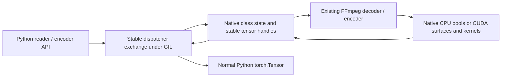

# Nelux PyTorch stable ABI migration guide

Date: 2026-09-29. Status: migration implementation and release acceptance contract. Source baseline: `46cdc18`. The indexed/temporal API, output-copy/layout options and optional asynchronous CUDA surface retirement are already part of this baseline. A passing build does not establish full parity.

## 1. Objective and recommended decision

Build a Nelux wheel that can run with multiple supported PyTorch releases without rebuilding for each torch minor, while preserving the current reader/writer API, output ownership, pixel semantics, and decoding performance.

**Selected implementation: PyTorch 2.12 stable ABI with the existing pybind classes.** Use stable C shims and `torch::stable::Tensor` internally, and stable registered dispatcher exchange operators at the Python boundary. Preserve FFmpeg decoding, CPU pools, CUDA kernels and worker execution.

The required runtime minimum is **2.12** (`torch>=2.12,<3`). Validate the same wheel on released 2.12/2.13/2.14 runtimes. A compatible ROCm torch can use CPU decoding and software encoding; this migration adds no AMD GPU output, ROCm tensor inputs or ROCm acceleration. GPU features still require NVIDIA CUDA/NVDEC/NVENC.

| Decision | Plan |
|---|---|
| Native torch boundary | Official stable C shims and stable C++ wrappers, with an explicit 2.12 target |
| Python API | Preserve `VideoReader`, `VideoEncoder`, their methods, signatures, defaults and normal `torch.Tensor` inputs/outputs |
| Python support | Preserve the existing Python >=3.13 policy; build separate wheels for supported CPython ABIs |
| Decode/encode algorithms | Preserve current FFmpeg and CUDA behavior during the ABI migration |
| NumPy output | Preserve it through the migrated tensor/owner boundary; this route still requires torch |
| CUDA ownership | Preserve the current borrowed streaming output and independently owned batch outputs |
| Distribution | Remove torch-minor wheel labeling only after the completed binary passes the release gates |
| Performance work | Schedule decoder caching, surface-lifetime changes and direct NVDEC separately |

“Version agnostic” means a declared stable ABI floor with ongoing compatibility validation. PyTorch's documented stable C compatibility commitment is at least two years; it is not an unlimited guarantee for every past or future release. CPython ABI, platform, CUDA runtime/driver and GPU architecture support remain separate. See the [official stable ABI note](https://docs.pytorch.org/docs/2.12/notes/libtorch_stable_abi.html) and the [original investigation](D:/Nelux/docs/pytorch-version-agnosticism.md).

## 2. Evidence behind this plan

| Finding | Established evidence | Limit |
|---|---|---|
| One native binary can cross torch minors | A 2.11-targeted prototype built against 2.13 ran unchanged on installed 2.12 CPU/CUDA, 2.13 CUDA and 2.14 CUDA torch | Fabricated CPU reader, not production FFmpeg/CUDA decoding; runtime 2.11 was not tested |
| Stateful pybind classes can survive the migration | The 2.14 converter probe retained class state, correct CPU shape/dtype/values and zero-copy CPU/CUDA tensor handoff | Only the 2.14 runtime was available for that binary |
| Stable CUDA stream lookup is usable locally | The 2.14 probe's native stream handle matched a selected non-default Python CUDA stream | Complete NVDEC/NVENC stream behavior remains unvalidated |
| A torch-free extension is possible | The DLPack CPU probe ran across the installed torch versions and imported without torch | CUDA, unsigned 16-bit output, input consumption and pool reuse were not prototyped |
| The ABI change need not dominate decode cost | Controlled buffer wrapping added about 0.177 microseconds per call through the stable boundary | This is a small-buffer handoff measurement, not an end-to-end FPS guarantee |
| There is a production precedent | TorchCodec 0.12 adopted stable ABI compatibility from torch 2.11; released source uses stable tensors/operator registration | Its dispatcher-oriented binding design differs from Nelux's class boundary |
| A direct NVDEC rewrite is not required | Local TorchCodec 0.16 CUDA comparison measured about 693 FPS for direct NVDEC, 679 for its older CUDA path and 698 for Nelux | One Windows/RTX 3090 sequential 1080p workload; no universal backend ranking |

Evidence: [ABI investigation and probes](D:/Nelux/docs/pytorch-version-agnosticism.md), [CUDA backend investigation](D:/Nelux/docs/torchcodec-faster-backend.md), [TorchCodec 0.12 release](https://github.com/meta-pytorch/torchcodec/releases/tag/v0.12.0), [released TorchCodec stable operators](https://github.com/meta-pytorch/torchcodec/blob/v0.16.0/src/torchcodec/_core/custom_ops.cpp).

The prototype sources, binaries and raw measurements live under the ignored `out/pytorch-compatibility-investigation/` directory. They are reference material. Promote the relevant assertions into maintained tests during implementation; do not make release validation depend on an ignored scratch directory or the existing `stable-abi-prototype/` being present.

## 3. Preserve the observable contract

Record these properties before changing code and compare them after each port:

- Reader/encoder methods, keyword arguments, defaults, exception types and close/context-manager behavior.
- CPU and CUDA shape, dtype, channel order, strides and contiguity, including grayscale/RGBA, resize, `force_8bit`, and high-bit-depth uint16 output.
- Batch ordering, duplicates, empty inputs, timestamps, range boundaries, reconfiguration and EOF behavior.
- Existing CPU pooled outputs remain valid after later reads, reader deletion and pool reconfiguration; their actual leases determine reuse.
- Sequential CUDA output continues to reuse its reader buffer. Retention requires the documented clone/stream discipline; converting it to owned output is a separate API change.
- Encoder input storage stays alive until asynchronous conversion/encoding has finished reading it, including error and close paths.
- Worker threads remain native. Python object conversion occurs with the GIL held; decoding and conversion continue under the current GIL-release and locking discipline.
- CPU-only torch installations can import the intended wheels and use CPU features. An unavailable GPU path raises an actionable error rather than triggering a DLL/loader crash.

Known behavior must be separated from intended semantics. The API scan reproduced incorrect `frame_at`/`get_batch` frame identities on a VFR fixture, while range iteration already has meaningful PTS/VFR handling. Record that defect as an existing baseline issue, with its fixture and expected frame identities; do not describe all Nelux access as exact or all VFR handling as broken. Fixing indexing belongs in a separately attributable change. See [API findings and probe evidence](D:/Nelux/docs/torchcodec-api-scan-2026-09-28.md).

## 4. Files and dependencies to migrate

| Area | Current files | Required work |
|---|---|---|
| Shared torch include | [CxCore.hpp](D:/Nelux/include/Nelux/CxCore.hpp) | Remove transitive `torch/extension.h`; include stable/native utilities explicitly where needed |
| CPU decoder and pooled ownership | [Decoder.cpp](D:/Nelux/src/Nelux/backends/Decoder.cpp), [Decoder.hpp](D:/Nelux/include/Nelux/backends/Decoder.hpp) | Stable buffer wrapping, tensor metadata and return types; retain shared pool lease/generation logic |
| Batch allocation and slices | [BatchDecoder.cpp](D:/Nelux/src/Nelux/BatchDecoder.cpp), [BatchDecoder.hpp](D:/Nelux/include/Nelux/BatchDecoder.hpp) | Stable allocation, views, copies, pointer offsets and dtype/device handling |
| Indexed/temporal decoder, when included | [IndexedDecoder.cpp](D:/Nelux/src/Nelux/IndexedDecoder.cpp), [IndexedDecoder.hpp](D:/Nelux/include/Nelux/IndexedDecoder.hpp) | Port tensor return types, dtype/device configuration and destination allocation; cover the temporal API too |
| Reader output and NumPy | [VideoReader.cpp](D:/Nelux/src/Nelux/python/VideoReader.cpp), [VideoReader.hpp](D:/Nelux/include/Nelux/python/VideoReader.hpp) | Stable internal storage, public conversion, NumPy owner lifetime, random/range/reconfigure paths |
| Encoder tensor pipeline | [VideoEncoder.cpp](D:/Nelux/src/Nelux/python/VideoEncoder.cpp), [VideoEncoder.hpp](D:/Nelux/include/Nelux/python/VideoEncoder.hpp) | Stable input conversion, allocation/transfers, normalization and retained tensors |
| Hardware decoder tensor operations | [CUDA Decoder.cpp](D:/Nelux/src/Nelux/backends/cuda/Decoder.cpp), [CUDA Decoder.hpp](D:/Nelux/include/Nelux/backends/cuda/Decoder.hpp) | Stable output/batch tensors without changing surface fences or conversion kernels |
| Torch CUDA stream access | [CudaStream.cpp](D:/Nelux/src/Nelux/CudaStream.cpp), [CudaStream.hpp](D:/Nelux/include/Nelux/CudaStream.hpp) | Replace ordinary c10 CUDA types and hardcoded Linux C++ symbols |
| GPU runtime diagnostics | [CudaRuntimeGuard.hpp](D:/Nelux/include/Nelux/CudaRuntimeGuard.hpp), [FFmpegDelayLoad.cpp](D:/Nelux/src/Nelux/FFmpegDelayLoad.cpp) | Stop treating the old c10 DLL dependency as the new compatibility contract; preserve independent FFmpeg delay loading |
| Bindings and type stubs | [Bindings.cpp](D:/Nelux/src/Nelux/python/Bindings.cpp), [_nelux.pyi](D:/Nelux/nelux/_nelux.pyi) | Remove ordinary Tensor casters; preserve documented public return/input types and signatures |
| Build/link policy | [CMakeLists.txt](D:/Nelux/CMakeLists.txt), [pyproject.toml](D:/Nelux/pyproject.toml) | Fixed ABI target, controlled build headers, permitted imports and explicit runtime support policy |
| Loader and wheel identity | [__init__.py](D:/Nelux/nelux/__init__.py), [tag_wheel_torch.py](D:/Nelux/tools/tag_wheel_torch.py) | Pre-load minimum check, stable-build metadata, removal of exact-minor wheel labels |
| Release and runtime validation | [.github/workflows](D:/Nelux/.github/workflows) | Build once per platform/Python/CUDA profile, then distribute the identical artifact to runtime-matrix jobs |

The indexed decoder, temporal APIs, output-copy/layout options and optional asynchronous surface retirement are already present in the selected baseline and must retain parity. Include all of their tensor paths.

Start with an audit across `include`, `src`, `nelux`, build scripts and release workflows. Search examples:

```powershell
rg -n 'torch::|at::|c10::|ATen|torch/extension|torch/torch|THPVariable|TORCH_CHECK' include src
rg -n 'torch_cpu|torch_python|torch_cuda|c10_cuda|NELUX_TORCH_ABI|tag_wheel_torch' CMakeLists.txt tools nelux .github/workflows
```

Create a capability inventory mapping every used tensor operation to an allowed stable helper or an explicitly chosen replacement. Include exported C++ signatures, templates, destructors, exception/caster code and linked static objects, not just reader return values.

## 5. Target architecture and tensor boundary

Use a small internal support layer for repeated allocation, metadata, native-buffer wrapping and encoder normalization. Suggested new files are `include/Nelux/TensorSupport.hpp`, `src/Nelux/TensorSupport.cpp` and `include/Nelux/python/TensorInterop.hpp`; these are proposed names, not existing implementation. Avoid recreating the entire torch API in a wrapper library.



### Python interop

The Python converters introduced in 2.14 cannot serve a 2.12 floor. `TensorInterop.cpp` registers private `_capture(Tensor) -> ()` and `_export() -> Tensor` operators using `STABLE_TORCH_LIBRARY`, `STABLE_TORCH_LIBRARY_IMPL` and stable boxed registration. Existing pybind classes call these under the GIL to exchange ordinary Python tensors with stable C++ tensor handles.

An RAII thread-local exchange context owns the stable handle, checks direction and exactly-once consumption, rejects direct operator calls without an active conversion, and restores nested contexts. Never encode a native object pointer in a Tensor or inspect private Python Tensor layout. Class state and storage retain independent ownership. Validate subclass dispatch/reentrancy and rejected inputs.

Convert inputs before releasing the GIL; reacquire it before returning Python objects. Preserve native tensor storage throughout released-GIL work. NumPy owners must keep actual storage leases alive. Native deleters must not retain Python objects without an explicit GIL/lifecycle strategy.

### Required capabilities

| Capability | Implementation rule |
|---|---|
| Shape, strides, dtype, device, pointer | Use stable tensor metadata. Cache immutable per-frame layout values rather than issuing redundant calls in hot loops |
| Empty output allocation | Use stable operations with explicit shape/dtype/device; preserve allocation frequency and output ownership |
| Native CPU pool wrapping | Use stable `from_blob` with a capturing owner/deleter; capture the actual pool/buffer lease and generation |
| Batch destinations and views | Preserve offsets, element sizes, duplicate placement, strides and ownership; prefer views/raw destinations where already used |
| Cast, transfer, contiguous layout | Use stable operations where available; preserve exactly when a copy is performed |
| Multiply, divide, round, clamp | Resolve the encoder operation gap explicitly; see section 6 |
| Current CUDA stream | Lazily resolve the public 2.12 CUDA stream C shim; verify per-device and non-default streams |
| Python tensor exchange | Stable registered dispatcher exchange under the GIL; no ordinary Tensor caster or private Python tensor layout |

Using header-only dtype/shape helpers does not by itself introduce an unstable dependency. Conversely, changing `torch::Tensor` spelling while retaining ordinary ATen/c10 calls does not create a stable ABI. Replace ordinary `TORCH_CHECK` with an appropriate supported check such as `STD_TORCH_CHECK`, preserving the public exception behavior. Check actual imports as well as source. [stable operation coverage](https://github.com/pytorch/pytorch/blob/v2.12.0/torch/csrc/stable/ops.h), [official migration examples](https://docs.pytorch.org/docs/2.12/notes/libtorch_stable_abi.html#migrating-your-kernel-to-the-libtorch-stable-abi).

## 6. Encoder arithmetic is a required work item

PyTorch 2.12 stable headers do not provide named wrappers for every multiply/divide/round/clamp operation used by Nelux. Namespace replacement alone will leave these paths unresolved.

**Initial choice:** use the stable boxed dispatcher for missing operations where its schemas and scalar arguments are supported and validated on the target platforms. Centralize those calls in the tensor support layer. Keep native specialized kernels or Python preprocessing as explicit fallbacks if dispatcher behavior or performance is unsuitable; do not silently choose different pixel math.

For each call, record the exact operator overload/schema, argument types, scalar promotion, output dtype/device and any allocation. Stable shim compatibility does not guarantee every dispatched operator schema forever. Windows upstream skips for some vector/string conversions are a reason to test the actual argument forms, not evidence that all stable dispatch is unusable.

Preserve each existing branch separately. Some grayscale paths round after float scaling; other RGB paths clamp and cast without rounding. There are also uint16-to-8-bit division paths, uint8-to-16-bit multiplication by 257, deep-frame handling, and gray/alpha specializations. Replacing them with one supposedly equivalent normalization function can change output.

Tests must exercise rounding boundaries, negatives, out-of-range values, supported floating/integer types, noncontiguous inputs, grayscale/RGBA, resize and CPU/CUDA transfer paths. Include non-finite floating values wherever the current accepted-input contract permits them. Compare converted pixels before lossy encoding where possible, since codec loss can hide a normalization error.

Migrate the holders used by FFmpeg buffer callbacks, queued GPU inputs and `retiredTensors` as well as the visible `encodeFrame` signature. Preserve error propagation, draining, lock ordering and the current release-under-GIL strategy until an equivalent lifecycle has been demonstrated.

## 7. CUDA rules during the migration

Replace direct c10 stream access and mangled-symbol resolution with the public 2.12 `aoti_torch_get_current_cuda_stream(device, &stream)` shim. Resolve it lazily from already-loaded CUDA torch libraries when a GPU path runs, preserving CPU-only import without an eager `torch_cuda` dependency. Guard GPU-only calls with real device/runtime availability; never hardcode the default stream or depend on c10 object layout.

Retain the distinction between three responsibilities:

1. **Execution ordering:** conversion waits for the producer; the torch consumer waits for conversion.
2. **Storage lifetime:** input/output tensors and CUDA allocation owners outlive every operation reading/writing them.
3. **Surface reuse:** NVDEC/FFmpeg surfaces are released only after conversion no longer reads them.

A producer event alone does not solve later consumer reuse or allocator lifetime. Maintain current event waits and any required `record_stream`/allocator treatment through a supported boundary. If an allocator-lifetime operation is missing from stable wrappers, resolve it explicitly with a stable dispatcher-supported operation, a Python-side handoff under the GIL, or an ownership/completion policy before releasing that path.

**Preserve both existing surface retirement modes in the ABI port.** The ordinary completion wait and the optional asynchronous bounded retirement queue are already in the chosen baseline. Preserve their fences, queue bounds, error/close draining and borrowed-output consumer discipline; do not change overlap behavior during compatibility benchmarking.

Test both import orders (`import nelux` and `import torch; import nelux`), CPU-only torch without GPU libraries, CUDA torch without a usable GPU, selected devices, non-default streams, queued model work and allocator pressure. CUDA failure should affect requested CUDA operations rather than otherwise usable CPU functionality.

## 8. Implementation phases

Keep changes reviewable. Shared tensor declarations and their callers must move together; prefer a compilable connected slice over isolated namespace substitutions. During intermediate ports, retain the existing exact-minor compatibility restriction. Do not advertise a partly stable wheel.

### Phase 0 — establish the contract and baseline

- [ ] Confirm the 2.12 floor, Python/platform/CUDA profiles and runtime torch installation policy in this guide.
- [ ] Record source commit, binary hashes, compiler flags, resolved FFmpeg version, CUDA toolkit/driver, GPU, relevant environment variables and benchmark inputs.
- [ ] Build an ordinary-LibTorch baseline against **the same torch 2.12 runtime** planned for the migration comparison. Comparing a 2.13 baseline with a 2.12 candidate would mix the ABI change with a runtime change.
- [ ] Run representative existing reader, batch, range, ownership and encoder tests. Save existing failures, including the VFR fixture, separately from new regressions.
- [ ] Save CPU/CUDA throughput, latency and peak memory measurements with the ownership/layout contracts made explicit.

Deliverable: reproducible baseline and complete tensor-operation inventory.

### Phase 1 — introduce the supported boundary

- [ ] Add the small stable tensor/interop support layer using 2.12 headers.
- [ ] Port the proven exchange/buffer-owner/stream assertions into maintained tests using actual shape/dtype/pointer/lifetime checks.
- [ ] Define the ABI target on every target compiling stable code. Preserve existing build mode behavior while production callers are ported.
- [ ] Choose and test replacements for every encoder operation missing a named wrapper.

Deliverable: boundary helpers that compile and pass CPU/CUDA interop checks; no change to the compatibility claim.

### Phase 2 — port reader, CPU decode and batch ownership

- [ ] Replace ordinary native tensors in the reader, CPU decoder and batch path, including shared declarations and affected call sites.
- [ ] Include indexed/temporal tensor paths added since the recorded baseline and their behavior tests.
- [ ] Preserve pool lease/generation handling, zero-copy wrapping and outstanding-frame validity.
- [ ] Port bindings for the affected methods to explicit stable input/output conversion.
- [ ] Preserve NumPy array base ownership and image dtype/layout across close and reconfigure.
- [ ] Validate empty/duplicate batches, range boundaries, EOF, random access and grayscale/RGBA/high-bit-depth outputs.

Deliverable: a real FFmpeg CPU reader/batch slice using the stable boundary and passing behavioral checks.

### Phase 3 — port CUDA tensor operations and stream access

- [ ] Replace ordinary CUDA output/batch tensor operations and c10 stream dependencies.
- [ ] Preserve direct conversion into the output tensor, existing fences, surface wait, output reuse and duplicate-copy behavior.
- [ ] Update runtime capability checks that depend on old Torch CUDA DLL names.
- [ ] Run actual NVDEC tests, high-bit-depth cases and non-default-stream/lifetime/allocator-pressure checks.
- [ ] Verify the intended CUDA-capable artifact still imports and decodes CPU input on CPU-only torch.

Deliverable: real hardware-reader coverage, not merely a CUDA tensor round trip.

### Phase 4 — port the encoder completely

- [ ] Replace all encoder tensor signatures, holders, normalization, allocation and transfer operations.
- [ ] Validate software encoding and actual NVENC where available.
- [ ] Exercise asynchronous submission, immediate input deletion, close/error draining and reconfiguration under queued work.
- [ ] Compare preprocessing pixels for rounding/clamping/dtype semantics and use appropriate encoded-output parity checks.

Deliverable: migrated reader and writer, including native callbacks and background ownership.

### Phase 5 — remove unstable build and binary dependencies

- [ ] Remove the transitive ordinary Torch header and ordinary tensor casters from production source.
- [ ] Remove direct references to ATen/c10 C++ functions, private Python tensor types and hardcoded mangled Torch symbols.
- [ ] Clean both `NeluxLib` and the `nelux` module link lists; inspect CUDA/static objects that are linked into the final extension too.
- [ ] Remove obsolete Torch CUDA delay-load/dynamic-symbol plumbing only when its calls are gone. Preserve FFmpeg's independent loader/bundling behavior.
- [ ] Produce and check a stable-import allowlist on Windows, Linux and macOS CPU builds.

Deliverable: the final extension's own Torch-related imports use only the permitted stable boundary. The small Windows probe needed only `torch_cpu.dll` directly; the production link set must be established by the full binary audit, not assumed from that probe.

### Phase 6 — validate one artifact across runtime environments

- [ ] Build each platform/Python/CUDA-profile artifact once, record its hash and install that exact wheel in every relevant runtime-matrix job.
- [ ] Test the 2.12 floor, CPU/CUDA variants and later released minors when available. Add nightly smoke coverage as early warning, clearly distinguished from supported releases.
- [ ] Run the selected functional suites against installed wheels outside the source checkout, preventing a local extension from shadowing the tested wheel.
- [ ] Run matched before/after performance checks on the same runtime and machine.
- [ ] Record which combinations passed, failed or were unavailable; a skipped hardware test is not proof that NVDEC/NVENC passed.

Deliverable: artifact-level compatibility, correctness and performance evidence. Historical probes are not production acceptance evidence; validate the 2.12-floor artifact unchanged across 2.12/2.13/2.14.

### Phase 7 — switch packaging and publish the support policy

- [ ] Replace the exact-minor check with a minimum/version-policy check that executes before `from ._nelux import ...`.
- [ ] Import torch and validate availability/version before loading the dependent extension, while retaining useful DLL/FFmpeg diagnostics.
- [ ] Ship Python-side build metadata containing ABI kind and floor so pre-load validation does not require loading an incompatible extension first.
- [ ] Stop using `tag_wheel_torch.py` to imply one torch minor per wheel; update every release workflow and downstream install example.
- [ ] Expose diagnostic build information distinguishing the stable ABI target from the torch version used to build. Preserve or deprecate existing diagnostic attributes deliberately.
- [ ] Update `pyproject.toml`, stubs, usage/install docs and release notes with the supported floor and tested combinations.

Deliverable: stable-ABI release artifacts and an accurate public compatibility claim, with all gates below satisfied.

## 9. Build and packaging details

### Explicit ABI target

Use the 2.12 target encoding throughout relevant compilation units. A starting CMake definition for the existing targets is:

```cmake
target_compile_definitions(NeluxLib PUBLIC
    TORCH_TARGET_VERSION=0x020c000000000000)
target_compile_definitions(nelux PRIVATE
    TORCH_TARGET_VERSION=0x020c000000000000)
```

Apply equivalent definitions to any other target that includes stable headers. Ensure the library/module use the same target. Compile against controlled 2.12 headers; unbounded build isolation must not accidentally raise the effective ABI floor. Prefer exact floor-version installation in release builds, with the intended CPU/CUDA index selected explicitly. Constrain `[build-system].requires` appropriately or document the controlled no-isolation build; do not leave the current unbounded `torch` requirement unexplained.

Do not bundle torch itself into the Nelux wheel. Retain necessary platform/compiler/C++ runtime settings and FFmpeg/native dependency rules. Stable torch ABI does not make CPython `cp313`/`cp314` wheels interchangeable or make an ordinary pybind extension `abi3`.

### Runtime dependency policy

The migration still requires torch even for the current NumPy path. Declared metadata is `torch>=2.12,<3`, rather than an exact minor or CUDA local-version pin. An already installed compatible CPU/CUDA torch can satisfy that requirement. Document explicit torch installation from the desired index before Nelux, since metadata does not select the user's CUDA build.

If the project retains its bring-your-own-torch policy, record that as a deliberate distribution decision and keep an early actionable runtime check. Do not present absence of a metadata dependency as compatibility or make missing torch appear to be a missing FFmpeg DLL. If version parsing uses `packaging.version`, declare that dependency rather than relying on a transitive install. Define prerelease/nightly policy explicitly.

### Binary audit

Inspect the **Nelux-produced binaries' own imports/undefined symbols**, including linked object code. Use `dumpbin /imports` on Windows, `readelf`/`nm` on Linux and `otool`/`nm` on macOS. Compare with an allowlist of stable shims and expected native/Python libraries. Do not reject torch's own internal ATen dependencies merely because they exist transitively inside the installed torch distribution.

Check for eager CUDA library dependencies that would break the intended CPU-only import case. Absence of `torch_python` alone is insufficient: ordinary ATen/c10 imports or a private Tensor caster still defeat the compatibility goal.

### Maintained artifact gates

`tools/audit_torch_stable_abi.py` requires exact torch 2.12.0 build headers. It scans wheel binaries' own imports (PE including delay imports, ELF or Mach-O), rejecting ordinary/private torch symbols, unknown C shims, bundled torch/CUDA runtimes and eager CUDA/c10/torch_python dependencies. Its JSON manifest records the repaired wheel SHA256, header version and imports. Source review and GPU tests also validate lazy stream resolution, which is outside the static import table. Build the standalone `tests/stable_abi` boundary probe once against the same floor, audit its imports, record its SHA256 in the wheel audit manifest, and reuse it unchanged in every runtime-matrix environment. It is an artifact for tests and is not shipped inside the Nelux wheel.

`tools/stable_abi_runtime_gate.py` verifies that manifest and installs the unchanged wheel in a fresh venv outside the checkout with an explicit torch runtime/index. Staged ABI/temporal/layout tests and real-decode/range corpus gates verify installed modules and record hashes, commands, failures, crashes, timeouts and skip counts. Hosted CPU and CUDA-torch jobs establish CPU behavior/import compatibility only; they do not establish NVDEC/NVENC or performance parity.

`stable-abi-runtime.yml` covers 2.12.0/2.13.0/2.14.0 CPU and CUDA-torch profiles on Windows/Linux, and CPU on macOS, for CPython 3.13/3.14. A missing matching torch distribution fails the matrix rather than implying support. Publishing depends on this hosted matrix and the mandatory `stable-gpu-runtime` job in `createRelease.yaml`. The GPU job validates the identical audited wheels and boundary probes across all three torch releases and both CPython ABIs on trusted provisioned Windows/Linux X64 GPU runners, using `--require-gpu` to require actual NVDEC/NVENC FIFO tests without hardware skips. Missing hardware blocks publication. `range-gpu-validation.yml` remains available for additional manually dispatched validation. Review matched-baseline throughput results before declaring complete migration parity.

Prerelease torch is rejected unless `NELUX_ALLOW_TORCH_PRERELEASE=1` is set for separate nightly smoke tests. Wheel tags describe platform and CPython ABI rather than torch minor; retired `tag_wheel_torch.py` fails with an actionable message.

## 10. Validation and release gates

### Required runtime matrix

| Dimension | Required coverage |
|---|---|
| CPython | 3.13 and 3.14 where matching torch/platform wheels are available; one Nelux artifact per Python ABI |
| Platform | Windows x64, Linux supported release targets, macOS CPU |
| Torch release | Floor 2.12 and released 2.13/2.14 using the identical artifact; nightly smoke separately |
| Torch build | CPU-only and chosen CUDA-enabled variants; local CUDA/toolkit differences are tested, not inferred from ABI stability |
| GPU availability | Real NVDEC/NVENC runner; CPU-only machine; CUDA torch with unavailable GPU or unsupported input cases |
| Ownership/streams | Native CPU leases, CUDA borrowed output, batches, selected device/non-default stream, asynchronous encoder inputs |

Keep the matrix fact-based. Unsupported combinations should be listed explicitly; unavailable runners should not produce a green claim of hardware validation.

### Existing suites to reuse

Use the current test inventory and add only missing behavioral coverage. Relevant starting suites include:

- Public output/batch contract: [test_backend.py](D:/Nelux/tests/test_backend.py), [test_batch_support.py](D:/Nelux/tests/test_batch_support.py), [test_color_format.py](D:/Nelux/tests/test_color_format.py), [test_reconfigure_output_layout.py](D:/Nelux/tests/test_reconfigure_output_layout.py), [test_stub_surface.py](D:/Nelux/tests/test_stub_surface.py).
- Index/range/lifecycle: [test_indexing_semantics.py](D:/Nelux/tests/test_indexing_semantics.py), [test_range_edgecases.py](D:/Nelux/tests/test_range_edgecases.py), [test_set_ranges_segments.py](D:/Nelux/tests/test_set_ranges_segments.py), [test_reconfigure_api.py](D:/Nelux/tests/test_reconfigure_api.py), [test_memory_aliasing.py](D:/Nelux/tests/test_memory_aliasing.py).
- Hardware ordering/output: [test_cuda_pipeline.py](D:/Nelux/tests/test_cuda_pipeline.py), [test_cuda_pipeline_fifo.py](D:/Nelux/tests/test_cuda_pipeline_fifo.py), [test_nvdec_high_bit_depth.py](D:/Nelux/tests/test_nvdec_high_bit_depth.py), [test_rawvideo_nvdec.py](D:/Nelux/tests/test_rawvideo_nvdec.py).
- Writer behavior/lifetime: [test_encoder_lifecycle.py](D:/Nelux/tests/test_encoder_lifecycle.py), [test_async_encode_pipeline.py](D:/Nelux/tests/test_async_encode_pipeline.py), [test_encoder_defaults.py](D:/Nelux/tests/test_encoder_defaults.py), [test_image_sequence_encoder.py](D:/Nelux/tests/test_image_sequence_encoder.py), [test_nvenc.py](D:/Nelux/tests/test_nvenc.py).
- Packaging/dependency loading: [test_ffmpeg_bundle.py](D:/Nelux/tests/test_ffmpeg_bundle.py), plus fresh-process installed-wheel import/version checks.

Add focused assertions for stable dispatcher exchange, the same-artifact runtime matrix, buffer survival after reader destruction, exact deleter counts, NumPy base ownership, encoder normalization boundaries and incompatible-version rejection before extension load. Follow existing hardware skip conventions, but report actual hardware runs separately.

### Performance budget and the 3000 FPS question

These local boundary measurements provide scale, not a production prediction:

| Isolated operation | Extra time relative to ordinary LibTorch | Arithmetic projection from 3000 FPS if paid once per frame |
|---|---:|---:|
| Stable wrap of an existing native CPU buffer | +0.177 microseconds | About 2998 FPS |
| Stable small CPU tensor allocation/return | +1.047 microseconds | About 2991 FPS |
| DLPack protocol wrap of the native CPU producer | +2.339 microseconds | About 2979 FPS |

The projection uses `new_fps = 1 / (1 / 3000 + added_seconds_per_frame)`. Rows are alternative isolated scenarios; do not add them blindly or treat them as measured decode results. Real frame allocation, metadata call counts, copies, synchronization and workload overlap can change the outcome. CPU streaming already wraps pooled buffers, and the CUDA streaming reader reuses a tensor.

**Proposed release budget: no more than 1% sustained throughput loss on the declared priority workloads**, equivalent to at least 2970 FPS if the matched baseline is 3000 FPS. This is a project acceptance target, not an upstream guarantee. If run variability is comparable to the budget, collect longer/interleaved measurements before deciding. Investigate any added full-frame copy, per-frame allocation or synchronization even if an aggregate number passes.

Benchmark requirements:

1. Compare the ordinary baseline and stable candidate on the same torch runtime, compiler flags, FFmpeg, hardware, input and output contract.
2. Warm up and run repeated, sequential, non-overlapping measurements; randomize/interleave route order where practical.
3. Include completed CUDA work with synchronization at measurement boundaries; avoid adding a new per-frame host wait merely for timing.
4. Report construction/indexing separately from decode FPS, and record median/variation plus latency and peak RSS/VRAM where relevant.
5. Cover small/high-FPS inputs, 1080p, 4K, CPU thread/worker settings, streaming and batches, software/hardware encoding and non-default streams.
6. Specify whether frames are retained or discarded and whether output is borrowed/owned. Include required clones/transfers/preprocessing in an application comparison.

The local TorchCodec comparison (679/693 FPS) neither reproduces the user's 3000 FPS baseline nor predicts its migration result. CPU comparison findings likewise depend on threading and conversion-pool choices. Use [the performance scan](D:/Nelux/docs/torchcodec-performance-scan-2026-09-28.md) for experimental context, not as a throughput promise.

### Definition of done

- [ ] All public reader, batch, NumPy and writer paths use the selected supported boundary.
- [ ] No ordinary Torch Tensor caster, ATen/c10 C++ import, private Tensor layout dependency or hardcoded mangled Torch lookup remains in the shipped extension.
- [ ] Stable ABI target and actual build headers are recorded and consistent across compilation units.
- [ ] The exact same artifact passes every declared runtime combination; limitations and unavailable runs are published accurately.
- [ ] CPU pool, CUDA surface/output and asynchronous writer lifetimes pass real behavior tests.
- [ ] Pixel/dtype/shape/layout/API contracts and encoder normalization are preserved; known indexing defects are separately accounted for.
- [ ] Priority before/after performance measurements meet the budget with adequate signal above noise.
- [ ] The minimum/version check happens before native load, and missing/incompatible CPU/CUDA/FFmpeg cases have useful diagnostics.
- [ ] Wheel identity, runtime dependency policy, stubs, installation docs and release notes match the implementation.

## 11. Performance follow-ups after ABI stabilization

These findings are valuable, but combining them with the ABI port would make correctness and performance attribution harder:

| Follow-up | Reason to investigate | Constraint |
|---|---|---|
| Preserve CUDA batch decoder state and use verified seek/index planning | Current CUDA batch calls reopen and walk ordered outputs from zero, including late sparse targets | Existing isolation was chosen for seek/flush correctness; do not reuse guessed ordinals |
| Advance/discard raw frames before RGB conversion | Current CUDA batch/scalar preroll can convert unwanted frames | Reference dependencies still require decoding; preserve display order and timestamp selection |
| Deferred surface release / bounded overlap | Current conversion completion wait and producer fence serialize work | Retain each surface until device reads finish, and preserve borrowed-output consumer discipline |
| Compatible hardware-decoder reuse | TorchCodec caches direct NVDEC instances per GPU, default capacity 20 | Bound retained resources, ensure exclusive ownership and reset state safely |
| Direct NVDEC backend | Direct parser/decode/map control may reduce orchestration overhead | Keep FFmpeg demux; implement sequence/display callbacks, capabilities, fallback, timestamps and lifecycle |
| Optional owned CUDA output | Improves retained-frame/queued-consumer composition | Additive API change with allocation/memory cost; preserve existing borrowed mode |
| Consistent exact indexing and batch preprocessing | The API scan identifies VFR identity and resize/color composition gaps | Separate correctness/API scope and benchmark matching interpolation/layout semantics |

TorchCodec's release advertised up to 3× over its older GPU path, but the local direct-NVDEC gain was about 2%. Both old/new TorchCodec CUDA paths already share RGB kernels and skip RGB conversion for unwanted frames. Released v0.16 does not demonstrate fused CUDA YUV-to-RGB/resize/CHW transforms or adaptable decoder reconfiguration; its map call also blocks and includes internal output-surface work. Do not base Nelux's design or FPS forecast on those unimplemented assumptions. See [the released-backend investigation](D:/Nelux/docs/torchcodec-faster-backend.md).

## 12. Deferred alternatives

The selected 2.12 stable dispatcher exchange preserves the pybind class API. A torch-free DLPack core, a Python facade over operators, direct NVDEC rewrites, and AMD GPU/ROCm acceleration are separate designs. Supporting torch below 2.12 requires an independently selected floor and new binary/operation/runtime audit. Do not mix these alternatives into this migration.

## 13. Rollout and handoff

Use an isolated migration branch/check-out, preserving the recorded ordinary baseline and unrelated ongoing work. Keep experimental artifacts private until the full stable-import and behavior gates pass. Release a clearly documented prerelease first, validate the installed wheel on real CPU/GPU workloads, then publish the compatibility change with its minimum-version impact.

If regressions appear, restore distribution of the prior ordinary-ABI release with its exact torch-minor requirement intact. Do not disable its guard to make it appear compatible. Keep a benchmark/compatibility record tied to artifact hashes so rollback and later torch-version verification use the actual shipped binaries.

Suggested implementation handoff:

> Implement the PyTorch 2.12 stable ABI route in this guide. Preserve Nelux's public API, CPU pool leases, borrowed CUDA streaming output, FFmpeg/CUDA decode behavior and asynchronous encoder ownership. Complete the capability inventory and baseline first; port bindings, reader/batch, CUDA stream integration and writer arithmetic; then remove ordinary LibTorch imports and update packaging only after same-artifact validation. Preserve existing temporal/layout/async-retirement behavior. Keep new API changes, direct NVDEC rewrites and further surface optimizations separate. Add no ROCm acceleration. Record evidence for each release gate and report any unsupported operation or runtime combination explicitly.

## References

- [Nelux PyTorch compatibility investigation](D:/Nelux/docs/pytorch-version-agnosticism.md).
- [TorchCodec faster CUDA backend investigation and local measurements](D:/Nelux/docs/torchcodec-faster-backend.md).
- [TorchCodec/Nelux consolidated comparison](D:/Nelux/docs/torchcodec-vs-nelux.md), [API scan](D:/Nelux/docs/torchcodec-api-scan-2026-09-28.md), [performance scan](D:/Nelux/docs/torchcodec-performance-scan-2026-09-28.md).
- [PyTorch stable ABI guarantees and limitations](https://docs.pytorch.org/docs/2.12/notes/libtorch_stable_abi.html), [official operator tutorial](https://docs.pytorch.org/tutorials/advanced/cpp_custom_ops.html#libtorch-stable-abi-pytorch-agnosticism).
- [stable operations](https://github.com/pytorch/pytorch/blob/v2.12.0/torch/csrc/stable/ops.h), [versioned extension tests](https://github.com/pytorch/pytorch/blob/v2.12.0/test/cpp_extensions/test_libtorch_agnostic.py).
- [TorchCodec 0.12 stable ABI/default-backend release](https://github.com/meta-pytorch/torchcodec/releases/tag/v0.12.0), [v0.16 build target](https://github.com/meta-pytorch/torchcodec/blob/v0.16.0/src/torchcodec/_core/CMakeLists.txt).
- [DLPack specification](https://dmlc.github.io/dlpack/latest/python_spec.html), [PyTorch DLPack importer](https://github.com/pytorch/pytorch/blob/v2.12.0/torch/utils/dlpack.py), [PyTorch stream-lifetime guidance](https://docs.pytorch.org/docs/2.12/generated/torch.Tensor.record_stream.html).
